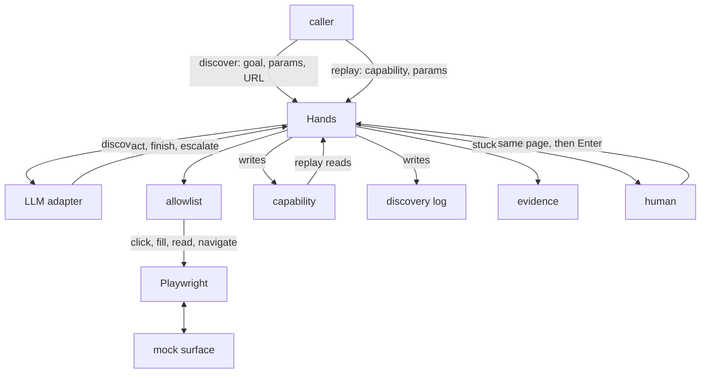

# Muscle

Hands for a Core Connect staff screen with no API. A model discovers get-savings-balance once. Replay runs that capability with no model.

This is an interface.ai take-home. It is not a bank product.

## Demo

A live headed run. Discover, then replay, then the three injects. Escalation waits for Enter.

<video src="evidence/hands_discover_replay_and_injects_demo.mp4" controls width="100%"></video>

[evidence/hands_discover_replay_and_injects_demo.mp4](evidence/hands_discover_replay_and_injects_demo.mp4)

## Architecture

One Hands module. The model only sits on discover. Replay reads the capability and never calls it.



## Setup

Bun and Playwright Chromium.

```bash
bun install
bunx playwright install chromium
bun test
```

Discovery needs `LLM_API_KEY` in `.env` at the repo root. Git ignores that file. `LLM_BASE_URL` and `MODEL` default to Cerebras, `https://api.cerebras.ai/v1` and `gpt-oss-120b`.

## Mock

`bun run mock` serves http://127.0.0.1:47821. Nested tables, no test IDs. Known member is `12345`. Savings is `$2,450.00`. Open sub-account is a button with no form.

## Discover

```bash
bun run mock
bun run discover --goal "Look up a member by ID and read the savings balance." --param memberId=12345
```

The model only decides. Playwright acts. A successful run writes `capabilities/get_savings_balance.v1.json`. Param names stay. The live member ID does not. The discovery log is `capabilities/get_savings_balance.v1.transcript.json`.

## Replay

```bash
bun run replay --capability capabilities/get_savings_balance.v1.json --param memberId=12345
```

Prints success and `$2,450.00`. Off-origin acts are refused.

```bash
bun run replay --capability capabilities/get_savings_balance.v1.json --param memberId=12345 --inject member_not_found
bun run replay --capability capabilities/get_savings_balance.v1.json --param memberId=12345 --inject session_timeout
bun run replay --capability capabilities/get_savings_balance.v1.json --param memberId=12345 --inject unexpected_dialog
```

`member_not_found` is a business outcome. `session_timeout` is a recoverable condition, dismissed inside the step. `unexpected_dialog` is stuck. Stuck writes `intervention.json` and waits for Enter on the same page. A step aimed at Open sub-account is risky and pauses the same way. Human clicks do not become capability steps.

`HEADED=1` shows the window.

I left the runs in `evidence/`. The timeout folder still has the interstitial. The unexpected dialog has the intervention. `REPORT.md` is the write-up. Spec is https://github.com/sivaratrisrinivas/muscle/issues/1
